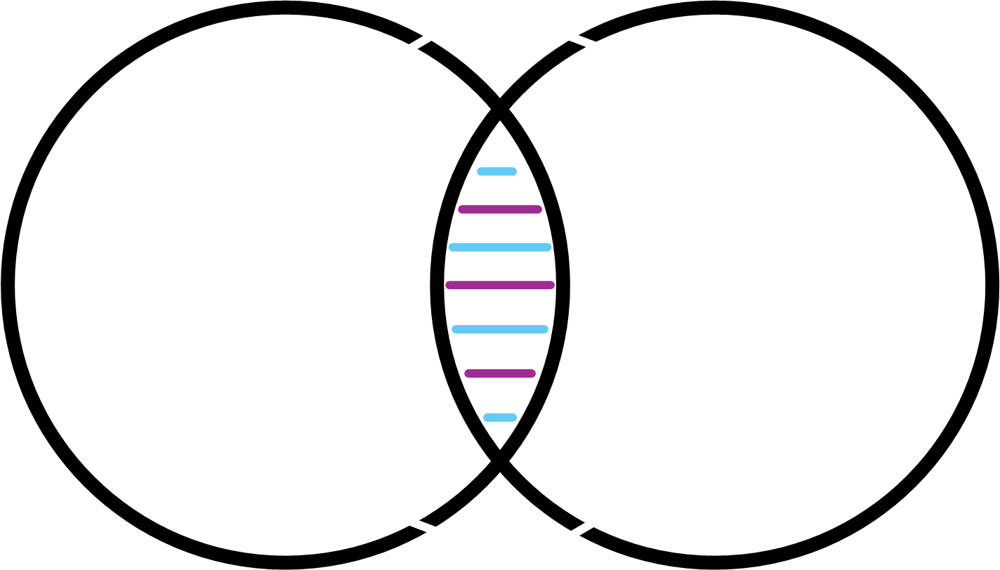

# The Problem

Modern hospitals rely heavily on Electronic Medical Records (EMR) and Healthcare Management Systems (HMS), yet they still struggle with lengthy, error-prone manual tasks. **Mentat** was born out of the need to reduce the complexity of recording symptoms, patient histories, and verbal reports.

> Numerous studies indicate the challenges of implementing EMRs. Even after adoption, they can create barriers for easy and intuitive information access (Rajkomar et al., 2019).

## Field Survey

We surveyed medical staff at the Sidney Kimmel Comprehensive Cancer Center, focusing on how much time they spent on patient data recording and retrieval.  
- **30+ minutes** per patient interview and standard symptom analysis.  
- **2+ minutes** per patient searching for data within EMR.  

These inefficiencies translate into time lost, increased potential for errors, and added frustration.

## Patent Survey

To understand if similar devices existed, we analyzed several patents dealing with automated question-asking and symptom collection. While some aspects overlap (e.g., audio-based patient interaction), Mentat stands out by functioning as a comprehensive tablet device that can be used independently for preliminary patient interviews and integrated seamlessly with existing hospital data flows.

### Figure Placeholder

## Pitch

Medical staff often complain about the time spent inputting patient information, especially in critical scenarios. **Mentat** offloads that burden by having natural conversations with waiting patients. The device summarizes key findings and organizes them for clinicians, who can then focus on providing the best possible care.  

> “Our tool navigates large databases to ask the best questions for each individual patient, just as a physician would.” — *Mentat Core Team*

## Logo

After iterative design, this logo reflects our vision of connectedness (circles united at the center) and the familiar DNA symbol for a clear medical identity.

## Design & Technology

### Software

- **Language Model:** Phi 3.5 mini deployed via LlamaEdge.  
- **Context Limit:** 32,000 tokens for thorough conversation memory.  
- **Dialogue Flow:** Utilizes question templates, regular expressions, and syntactic decomposition to systematically extract patient information.  
- **Inference Process (RAG):** Combines local structured text data with a retrieval-augmented generation approach, using cosine similarity to deliver relevant context.  
- **Few-Shot Learning:** Allows Mentat to adapt to various clinical scenarios with minimal additional data.

### Hardware

Our future design envisions a handheld tablet that remains offline and preserves data integrity:

1. **Nvidia Orin NX 16GB** – Core GPU for local inference.  
2. **ReComputer J4012** – Carrier board for Orin NX.  
3. **ReSpeaker Lite** – For natural language processing.  
4. **Touch Screen & Speaker** – For interactive and audio outputs.  
5. **Custom 3D-Printed Case** – Protects internal components.  
6. **Battery & Charger** – Ensures portability and uninterrupted usage.

## Future Plan

Our roadmap includes:
- Finalizing a handheld tablet with robust offline functionalities.  
- Conducting pilot tests in select hospitals to demonstrate time and cost savings.  
- Extending the language model to support multiple healthcare specialties.  

## Summary

**Mentat** aims to streamline data collection, reduce manual errors, and enhance diagnostic support for clinicians. Our solution stands as an effective tool for busy healthcare environments, combining advanced AI with user-centric design to improve both patient and provider experiences.

- **Contact**: [lphill49@jhu.edu](mailto:lphill49@jhu.edu), [lbrenap1@jhu.edu](mailto:lbrenap1@jhu.edu)
- **GitHub**: [github.com/janedoe](https://github.com/janedoe)

[Back to Home](./index.md)

