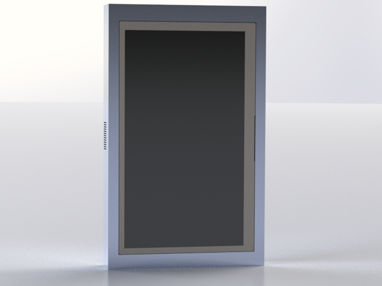

<!-- Logo at the top-left -->

  
  <h1 style="margin: 0;">Mentat: Transforming Medical Decision-Making</h1>

---

<!-- Hero image placeholder below the header -->

  

---

## Abstract

Healthcare professionals manage the complex tasks of recording and monitoring patient data, relying on systems prone to errors and time-consuming verbal communication. **Mentat** provides an end-to-end solution that automates data collection, retrieval, and diagnostic insights using a small language model optimized for low-power GPUs. This approach ensures secure, offline operation that does not depend on external servers, preserving patient data integrity.

---

## Key Features

1. **Efficient Data Recording**  
   - Automates symptom recording and patient history gathering.  
   - Minimizes manual effort and reduces transcription errors.

2. **AI-Assisted Diagnostics**  
   - Small language model (e.g., Phi 3.5 mini on LlamaEdge) runs locally.  
   - Integrates retrieval-augmented generation (RAG) for context-aware insights.

3. **Secure and Offline**  
   - No reliance on external servers—data remains within the clinic’s network.  
   - Local database integration ensures privacy and data integrity.

4. **Easy Integration**  
   - Designed for quick adoption into existing Healthcare Management Systems (HMS).  
   - Facilitates communication between nurses, doctors, and specialists.

---

## Want to Learn More?

- [The Problem](problem.md) – Understand the core challenges Mentat addresses.
- [References](references.md) – Explore the scholarly references behind Mentat.

---

## Founders

**Lauren Phillips**  
\[lauren.phillips@example.com\]

**Luis Brena**  
\[luis.brena@example.com\]

---
