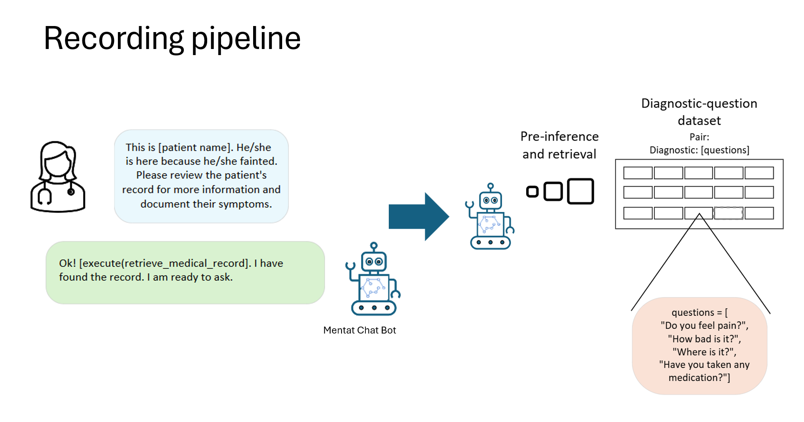
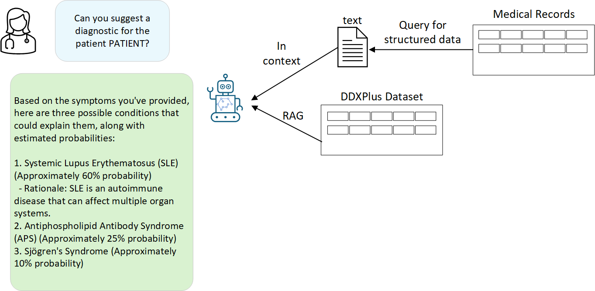
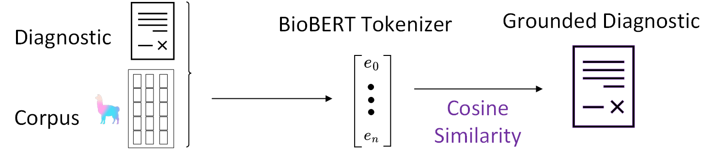

# Mentat Technology: An End-to-End System

Mentat combines natural language understanding with secure, locally hosted inference to streamline medical data collection and support clinical decision-making. The following sections illustrate how Mentat moves from conversation-based data gathering to inference and retrieval-augmented generation (RAG).

---

## Recording Pipeline

Mentat begins by automating patient data collection through conversation prompts. A medical professional initiates the process, and Mentat’s language model guides the dialogue until all necessary information is gathered.

<!-- Example images of the recording pipeline -->

*Figure 1. Mentat’s conversation-based system for gathering patient details.*

*Figure 2. Iterative question prompting and template-based dialogue flow.*

### How It Works

1. **Triggered Template**  
   When a medical professional makes a request—e.g., “Please document the patient’s symptoms”—Mentat starts a conversation template in which the model prompts the patient (or the professional) with relevant questions.

2. **Sequential Q&A**  
   - The model uses *regular expressions* plus a function \(f(q)\) to rephrase or refine questions.  
   - Answers are parsed with *syntactic decomposition* to extract key logical values \(\{v_1, v_2, \dots, v_n\}\).  
   - These values dictate the next questions and build context for the eventual diagnostic step.

3. **Condition Check & Data Saving**  
   - Once a stopping criterion \((y)\) is met—i.e., enough information is gathered—the conversation concludes.  
   - All captured text is organized into structured categories \(\{C_1, C_2, \dots, C_n\}\) by internally prompting the language model.  
   - This information is stored in JSON format for easy retrieval and parsing later on.

---

## Software & Language Model

Mentat uses **Phi 3.5 mini**, deployed via **LlamaEdge**, to handle natural language tasks efficiently:

- **Context Window**:  
  We have set a context limit of 32,000 tokens to evaluate and manage memory usage.  
- **No Fine-Tuning**:  
  During both implementation and testing, we used the base model without additional fine-tuning.  
- **Proactive Prompts**:  
  Mentat maintains a continuous conversation by using a sequence of question templates that iteratively engage the model until it completes the data-collection task.

---

## Inference, Databases, and RAG

After data collection, Mentat shifts into an inference mode to support clinicians:

1. **Structured Data Retrieval**  
   - A medical specialist selects a patient.  
   - Mentat queries its local database for the structured information (in JSON) gathered during the recording phase.

2. **Pre-Diagnostic Generation**  
   - The model uses the patient’s structured information as context.  
   - It produces a *pre-diagnostic*, which is essentially a textual summary of the potential issues or next steps.

3. **Retrieval-Augmented Generation (RAG)**  
   - Mentat employs a retrieval pipeline to fetch additional medical references from a local corpus.  
   - RAG integrates database queries and the model’s knowledge to bolster the pre-diagnostic with relevant facts, common treatments, or cautionary notes.

### Cosine Similarity & Embeddings

To ensure relevant retrieval, we leverage **cosine similarity** between BioBERT embeddings:

\[
\text{cosine\_similarity}(A, B) = \frac{A \cdot B}{\|A\|\|B\|}
\]

where \(A\) and \(B\) are vector embeddings of text. Higher cosine similarity indicates higher relevance.

We use **BioBERT tokenization** to generate these embeddings:

\[
V_x = \text{Embed}(x)
\]

where \(x\) is an input and \(V_x\) is the resulting vector. By comparing vectors, Mentat identifies the most pertinent documents in the corpus.

---

## Few-Shot Learning

Mentat adapts to new clinical scenarios by incorporating **few-shot learning**:

- **Minimal Labeled Data**:  
  The model can handle specific tasks with limited examples.  
- **In-Context Learning**:  
  We provide short demonstrations or instructions, and Mentat then refines its outputs accordingly.  
- **Improved Adaptability**:  
  This approach enhances Mentat’s ability to handle diverse medical inquiries and maintain consistent answer formatting.

---

## Putting It All Together

Below is a schematic illustrating how Mentat blends RAG and tokenization to move from a clinician’s question to a grounded diagnostic suggestion:

*Figure 3. Schematic for retrieval-augmented generation with BioBERT embeddings.*

1. **Diagnostic & Corpus**: Mentat takes the preliminary diagnostic and queries local medical records.  
2. **BioBERT Tokenization**: Converts text into embeddings, capturing semantic context.  
3. **Cosine Similarity**: Ranks potential matches from the corpus.  
4. **Grounded Diagnostic**: Combines the matched information with the initial question and context to produce a final, structured suggestion.

> **Note**: While Mentat aims to streamline patient data entry and provide *supportive* diagnostic insights, it is not a standalone diagnostic tool. Medical professionals remain the final authority on patient care and decisions.

---

## Hardware

Our future design envisions a handheld tablet that remains offline and preserves data integrity:

1. **Nvidia Orin NX 16GB** – Core GPU for local inference.  
2. **ReComputer J4012** – Carrier board for Orin NX.  
3. **ReSpeaker Lite** – For natural language processing.  
4. **Touch Screen & Speaker** – For interactive and audio outputs.  
5. **Custom 3D-Printed Case** – Protects internal components.  
6. **Battery & Charger** – Ensures portability and uninterrupted usage.

---

## Conclusion

By integrating proactive conversation templates, structured data storage, few-shot learning, and retrieval-augmented generation, Mentat provides a robust, *human-in-the-loop* system. This end-to-end approach helps medical teams collect patient data more reliably and generate targeted insights without compromising on security or data privacy.

